<div align="center">

# 🤖 DevCrew

### A local, multi-agent software development team

Planner · Architect · Developers · Reviewer · QA · Coordinator. They plan, design, build,
review and test your feature in Docker sandboxes, and you approve every important step.


**100% local models: no cloud LLM calls.**

</div>

<p align="center">
  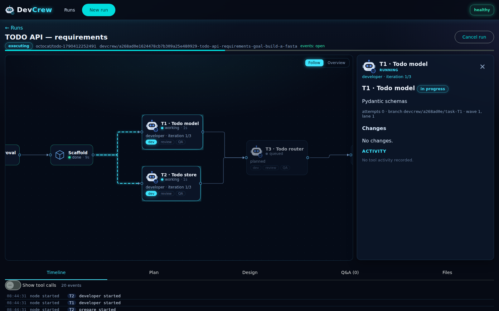
</p>

---

## ✨ What DevCrew does

You describe a feature, upload a requirements document or label a GitHub issue. DevCrew turns
it into a reviewed, tested pull request:

1. **Plans** it into user stories and a dependency graph of tasks.
2. **Designs** it: the Architect picks a template (or reads your existing code), defines
   modules and contracts, and assesses the plan.
3. **Builds** it: several developers work in parallel, each in its own git worktree. Every task
   is reviewed against coding rules and tested by QA in a sandbox.
4. **Checks** it: integration tests, secret scanning, dependency vulnerabilities and coverage.
5. **Delivers** a pull request, then **follows it up** on review comments, failing CI and
   merge conflicts.

You stay in control. You approve the plan, the design and the final result, answer the agents'
questions, and can chat with the crew, pause, set budgets or stop at any time.

## 🧩 Features

<table>
<tr>
<td width="50%" valign="top">

### 📄 Requirements in, workflow out
- Type a request or drop `.md` / `.txt` requirements documents, with a live preview.
- Works on **new projects** or **existing repositories** (Python, Java/Maven, Angular, detected
  automatically).
- **Full** mode (plan → design → build) or **Quick fix** (one approval).

</td>
<td width="50%">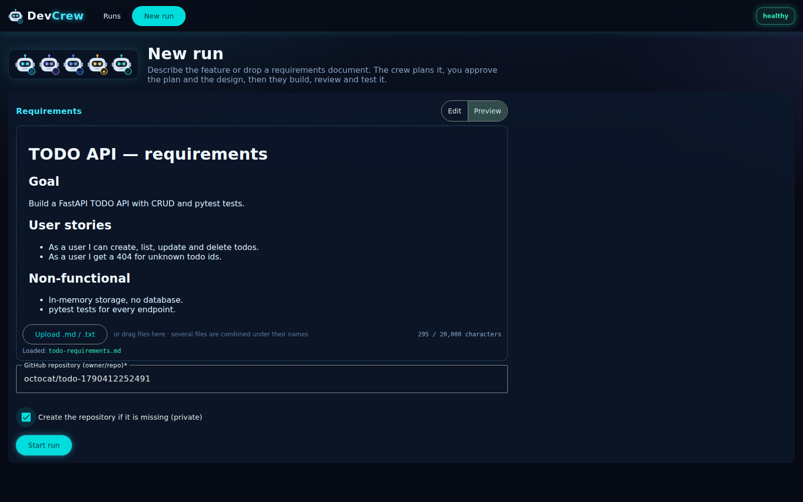</td>
</tr>
<tr>
<td valign="top">

### 🧭 Live workflow graph
- n8n-style graph: every stage and every task is a node with live status, the agent at work,
  iteration counts and activity.
- The side panel shows the plan, the design, diffs, test logs, Q&A and approvals.
- The Architect's **plan assessment** lists concerns, assumptions and suggested changes before
  you approve.

</td>
<td>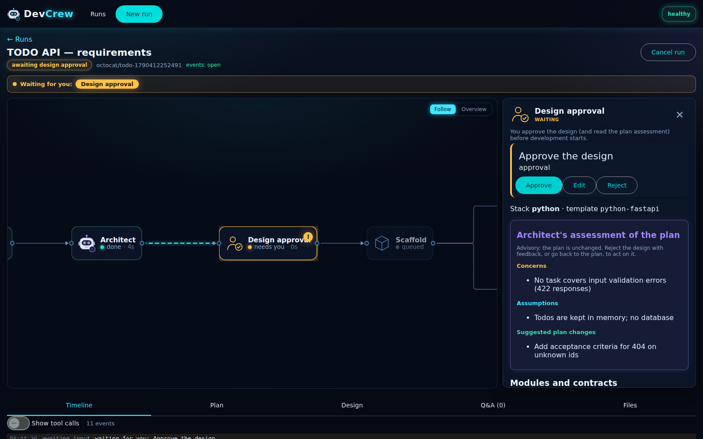</td>
</tr>
<tr>
<td valign="top">

### 🐙 GitHub automation
- Watches repositories: an issue labelled `devcrew` (or `devcrew:quick`) starts a run.
- Keeps one status comment per issue, and the PR says `Fixes #N`.
- **PR follow-up rounds**:
  - review comments from people with write access are triaged;
  - small fixes are pushed automatically, bigger ones wait for you;
  - failing CI and merge conflicts are fixed;
  - every thread gets a reply.

</td>
<td>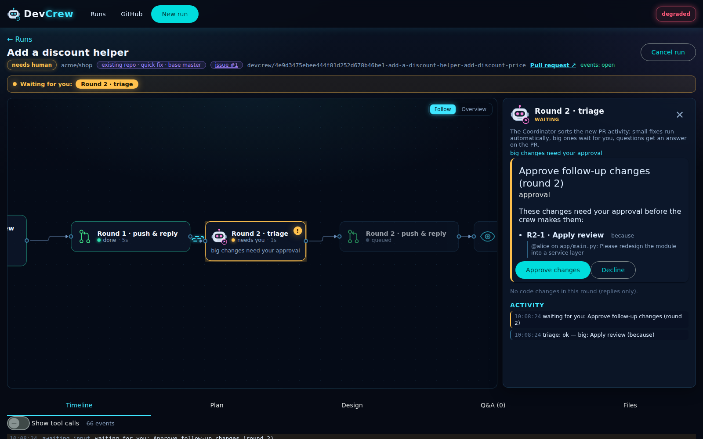</td>
</tr>
<tr>
<td valign="top">

### 💬 Steering while it runs
- **Chat** with the crew or a single task. Messages are applied at safe points: as notes,
  new tasks, cancelled tasks or answers.
- **Pause / resume** between waves and between a task's attempts.
- Edit or withdraw a message while it still waits.

</td>
<td>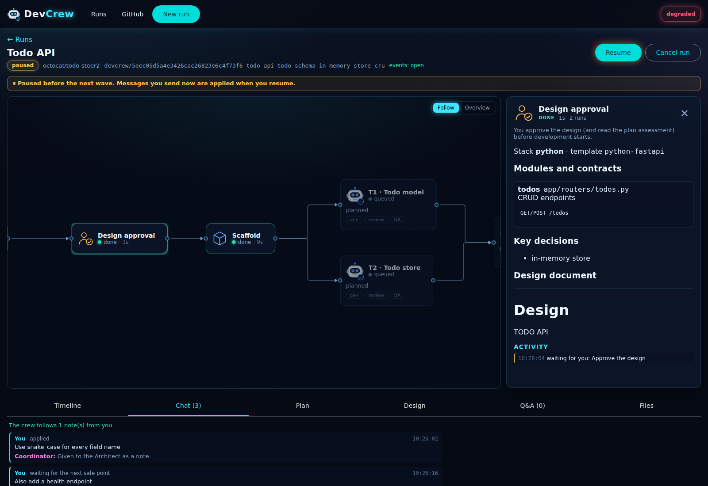</td>
</tr>
<tr>
<td valign="top">

### 📊 Usage and budgets
- Tokens per role and per task, model time, and working time vs. time spent waiting for you.
- **Token and time budgets**: at the limit the run asks you to continue or stop.
- **Retry** a failed run from its checkpoint, or **run again** with the same request.

</td>
<td>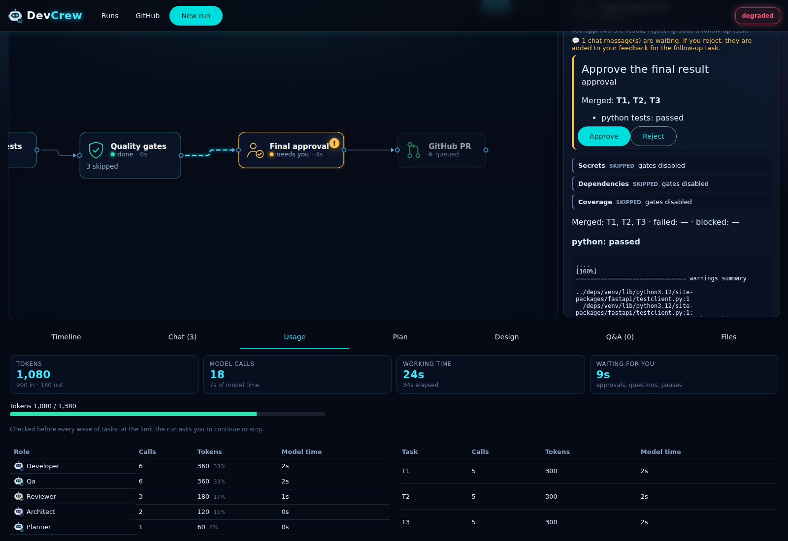</td>
</tr>
</table>

<table>
<tr>
<td width="50%" align="center">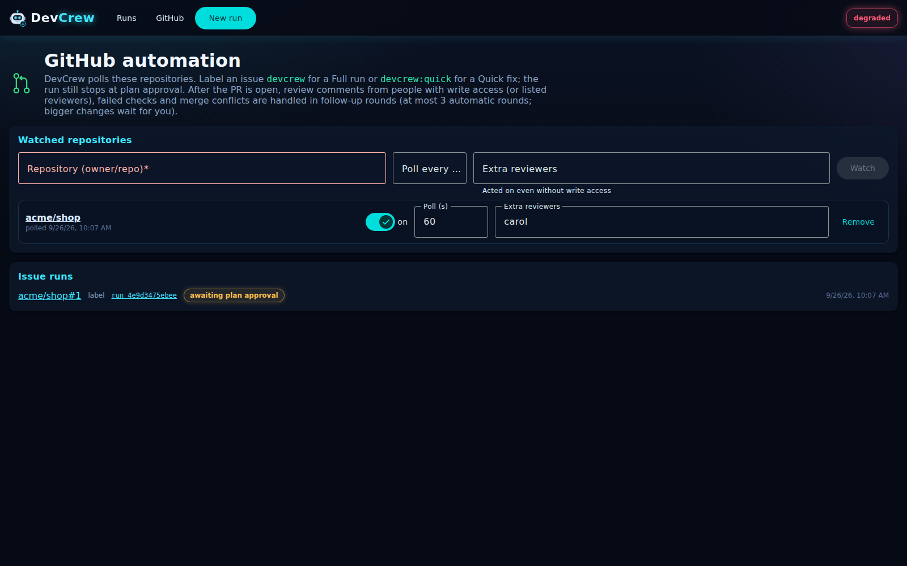<br><sub>Watched repositories and runs started from issues</sub></td>
<td width="50%" align="center">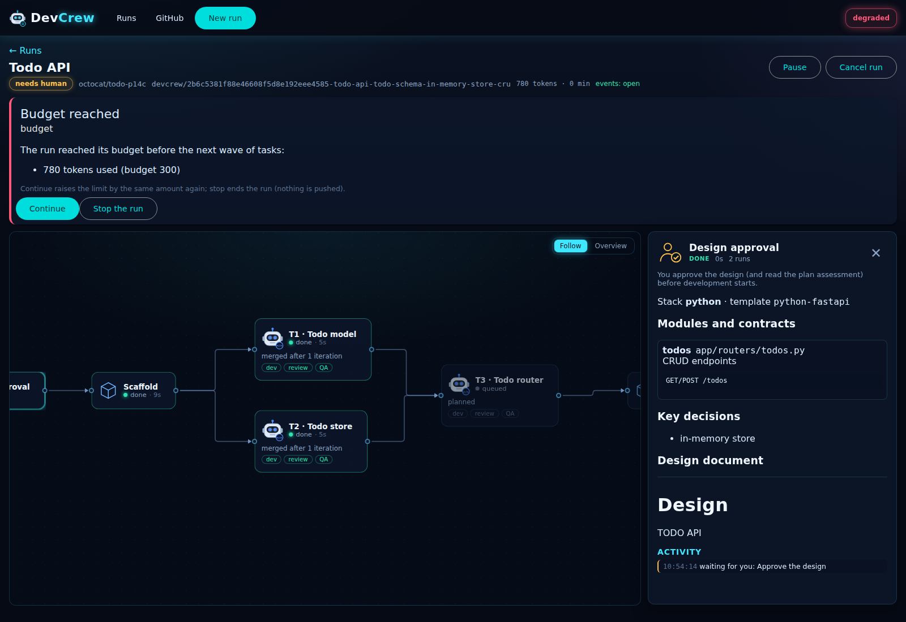<br><sub>A budget stops the run before the next wave and asks you</sub></td>
</tr>
</table>

### 🛡️ Quality and safety built in

| | |
|---|---|
| 🔒 **Sandboxed execution** | Generated code runs only in Docker: no network (except fixed dependency installs), no capabilities, read-only root, CPU/memory/time limits, and a command policy. |
| 🧪 **Tests at every level** | QA per task, the project's tests after every wave of parallel work, and full integration tests at the end. Pass/fail comes from exit codes, never from the model. |
| 🔑 **Quality gates** | gitleaks secret scan (never allowed through), osv-scanner dependency vulnerabilities, and a coverage threshold (or no drop vs. the base branch). Failures get an automatic fix task first. |
| 👤 **Human approvals** | Plan, design and final approval; nothing is pushed before the final approval, and the default branch of an existing repository is never pushed to. |
| ♻️ **Crash-safe** | Every step is checkpointed in Postgres; after a restart runs continue exactly where they stopped, and the UI replays missed events. |

## 🏗️ How a run flows

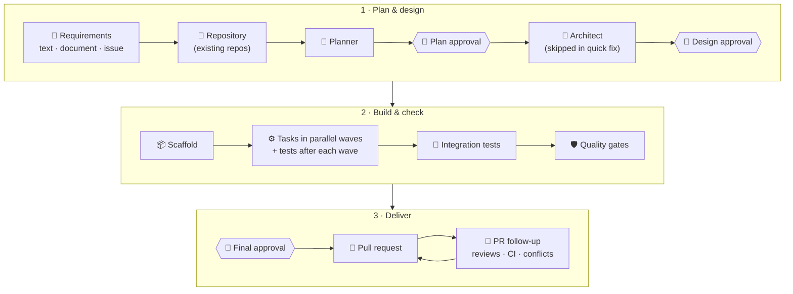

> 👉 See the **[end-to-end example](docs/EXAMPLE.md)**: a TODO API from a requirements
> document to a pull request, with every approval, a developer question and a review round-trip.

Each task runs in its own subgraph, git worktree and sandbox container:

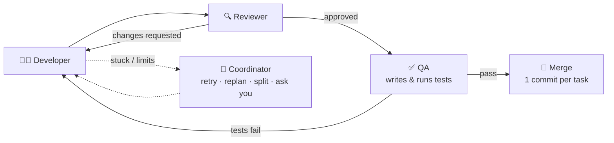

### 👥 The crew

| Agent | Role |
|---|---|
| 🤖 **Planner** | Turns the request into user stories and a validated dependency graph of tasks. |
| 🤖 **Architect** | Chooses the template or reads the existing code; defines modules and contracts, and assesses the plan. |
| 👩‍💻 **Developer ×N** | Implements one task in its own worktree; can read, write, search code, run commands and ask the Architect, the Planner or you. |
| 🔍 **Reviewer** | Reviews the diff against the design and the per-stack rules (`rules/*.md`, e.g. `PY-003`). |
| ✅ **QA** | Writes tests for the task and runs them in the sandbox. |
| 🧭 **Coordinator** | Handles failures (retry, replan, split, escalate), sorts PR review comments and applies your chat messages. |

## 🧱 Architecture

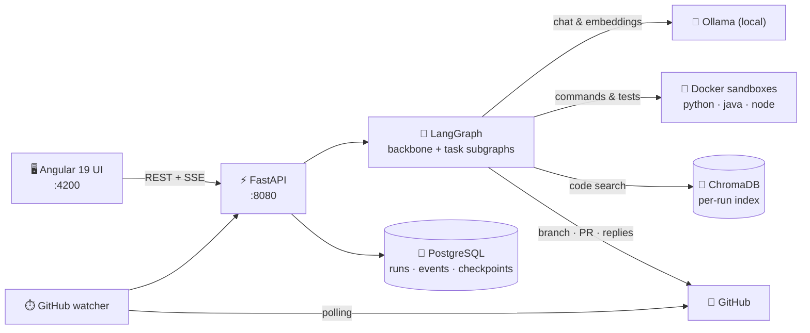

## 🛠️ Technology

| Layer | Technology |
|---|---|
| **Agents & orchestration** | LangGraph (StateGraph, `Send` for parallel tasks, interrupts for human input, Postgres checkpointer), LangChain Ollama |
| **Models** | Ollama, local only: `qwen2.5-coder:14b` for chat (one model, per-role settings in `models.yaml`) and `nomic-embed-text` for embeddings |
| **Backend** | Python 3.12, FastAPI, Pydantic v2, SQLAlchemy 2 (async), Alembic, httpx, Server-Sent Events |
| **Storage** | PostgreSQL (runs, event log, checkpoints, chat, GitHub watch list), ChromaDB (per-run code index) |
| **Retrieval** | Code-aware chunking (Python `ast`, brace matching for Java/TypeScript, Markdown headings), incremental re-indexing after every merge |
| **Sandbox** | Docker (one container per task), images for Python 3.12, Java 21 + Maven, Node 20 + Angular CLI + Chromium, plus gitleaks and osv-scanner |
| **Frontend** | Angular 19 (standalone components, signals, OnPush), Angular Material dark theme, ngx-vflow workflow graph, inline-SVG robot icons |
| **Git & GitHub** | git worktrees and squash merges, GitHub REST and GraphQL (issues, PRs, reviews, checks, thread resolution) |
| **Starter templates** | FastAPI · Spring Boot 3.5 (Java 21) · Angular 19 standalone |
| **Quality** | ruff, mypy (strict), pytest (359 tests plus 2 Docker-only, Ollama always mocked), ESLint, Karma/Jasmine (66 specs), a benchmark with 12 tasks and 93 hidden tests |

## 🚀 Quick start

**Prerequisites:** Docker with docker compose, and [Ollama](https://ollama.com) on the host.

```bash
# 1. Models (all local)
ollama pull qwen2.5-coder:14b
ollama pull nomic-embed-text
OLLAMA_NUM_PARALLEL=2 OLLAMA_HOST=0.0.0.0 ollama serve     # NUM_PARALLEL >= MAX_PARALLEL_DEVS

# 2. Sandbox images (once)
cd devcrew
scripts/build_sandbox_images.sh

# 3. Configure and start
cp .env.example .env        # set POSTGRES_PASSWORD, DATABASE_URL, WORKSPACES_DIR, GITHUB_TOKEN
mkdir -p "$(grep ^WORKSPACES_DIR .env | cut -d= -f2)"
docker compose up --build
```

| Service | URL |
|---|---|
| 🖥️ Web UI | http://localhost:4200 |
| ⚡ API + interactive docs | http://localhost:8080/docs |
| ❤️ Health check | http://localhost:8080/health |

All ports are bound to `127.0.0.1`: DevCrew is a single-user local tool without
authentication.

## ⚙️ Configuration highlights

Every variable is documented in [`.env.example`](.env.example); model settings are in
[`backend/config/models.yaml`](backend/config/models.yaml).

| Variable | Default | What it controls |
|---|---|---|
| `MAX_PARALLEL_DEVS` | `2` | Developers working at the same time (and concurrent model calls) |
| `MAX_DEV_ITERATIONS` | `3` | Attempts per task before the Coordinator steps in |
| `GITHUB_TOKEN`, `GITHUB_DELIVERY_ENABLED` | – | Pull requests and GitHub automation |
| `GATES_ENABLED`, `GATE_COVERAGE_MIN` | `true`, `70` | Quality gates and the coverage threshold |
| `WATCH_PRS`, `MAX_PR_ROUNDS` | `true`, `3` | PR follow-up rounds after delivery |
| `RUN_TOKEN_BUDGET`, `RUN_TIME_BUDGET_MIN` | `0` (off) | Default budgets per run |
| `WAVE_TESTS_ENABLED` | `true` | Project tests after every wave of tasks |
| `MAX_REQUEST_CHARS` / `MAX_DOCUMENT_CHARS` | `20000` / `200000` | Requests up to the first go to the Planner as-is; longer documents are condensed |

## 📁 Project structure

```text
devcrew/
├── backend/            FastAPI app, LangGraph graph, agents, sandbox, RAG, GitHub, API
│   ├── app/            api · graph · llm · db · events · sandbox · rag · gates · github · services
│   ├── prompts/        one prompt file per role
│   ├── config/         models.yaml (per-role model settings)
│   ├── alembic/        database migrations
│   └── tests/          pytest suite (fake models, fake GitHub, Postgres tests)
├── frontend/           Angular 19 UI (workflow graph, chat, usage, settings)
├── templates/          starter templates: python-fastapi · java-spring-boot · angular-standalone
├── rules/              per-stack coding standards the Reviewer enforces
├── sandbox/            Dockerfiles of the sandbox images (+ gate tools)
├── benchmarks/         12 tasks with hidden acceptance tests
├── scripts/            build_sandbox_images.sh · run_local.py · run_benchmark.py
└── docs/               technical guide and screenshots
```

## 🧑‍💻 Development

```bash
# Backend
cd devcrew/backend
uv venv -p 3.12 && uv pip install -e ".[dev]"
docker compose up -d postgres chromadb && alembic upgrade head
uvicorn app.main:app --reload --port 8080
ruff check . && ruff format --check . && mypy app tests alembic/env.py && pytest

# Frontend
cd devcrew/frontend
npm ci && npx ng serve                      # http://localhost:4200
npx ng lint && npx ng test --watch=false --browsers=ChromeHeadless
```

There is also a terminal client (`scripts/run_local.py`) and a benchmark runner
(`scripts/run_benchmark.py`). Both are described in the guide.

## 📚 Documentation

| Document | Contents |
|---|---|
| 🧭 [End-to-end example](docs/EXAMPLE.md) | One run step by step: requirements → plan → design → parallel tasks → review/QA → gates → PR |
| 📘 [Technical guide](docs/GUIDE.md) | Architecture, graph and design notes, HTTP API, sandbox, RAG, GitHub delivery and automation, steering, budgets, benchmark, and every run/dev command |
| 🗂️ [Backlog](BACKLOG.md) | Open issues, deferred work and decisions, by priority |
| 🧪 [Benchmark](benchmarks/README.md) | Benchmark tasks and hidden-test conventions |
| ⚙️ [`.env.example`](.env.example) | Every setting, documented |

## 🗺️ Status

| Phase | Delivered |
|---|---|
| 1–2 | Infrastructure, settings, health checks; the LangGraph backbone with five roles and human approvals |
| 3–4 | Docker sandboxes and starter templates; per-run code retrieval (RAG) |
| 5 | Parallel developers in git worktrees, the Coordinator, agent-to-agent Q&A |
| 6–7 | HTTP API with SSE replay and restart recovery; the Angular UI |
| 8–9 | GitHub delivery (repository, branch, PR); benchmark with hidden tests |
| 10 | Requirements documents, the workflow graph UI, the Architect's plan assessment, neon theme |
| 11 | Existing repositories (auto-detected), Full / Quick fix modes, quality gates |
| 12 | GitHub automation: issue intake by label, PR follow-up on reviews, CI and conflicts |
| 13 | Steering: chat with the crew or a task, pause / resume |
| 14 | Usage and budgets, tests after every wave, retry / run again, steering completed |
| 15 | GitHub efficiency (conditional requests, quiet-PR backoff), base-branch test baselines, long requirements documents, finer pause |

**Next:** a first run against real Ollama models and GitHub, then Phase 16 (GitHub
efficiency, real-run robustness, UI and features). See the [backlog](BACKLOG.md).
