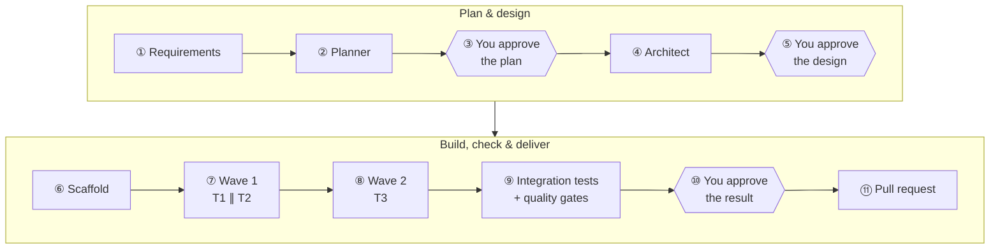
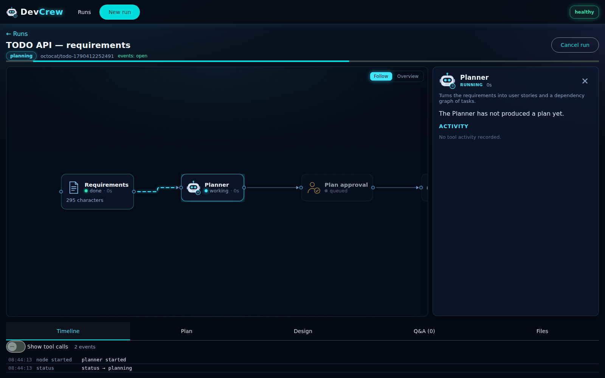
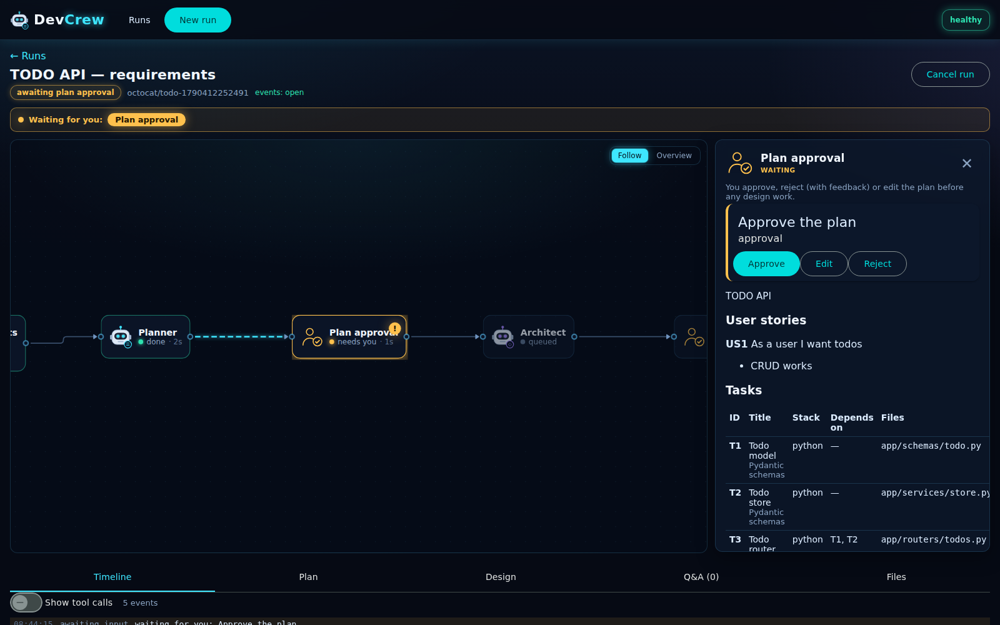
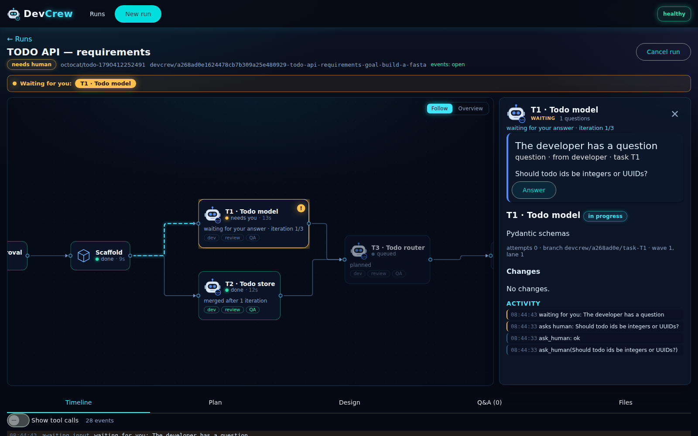
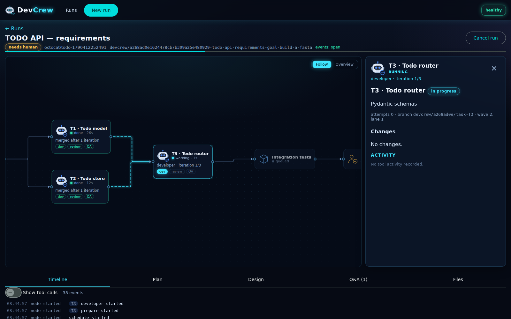
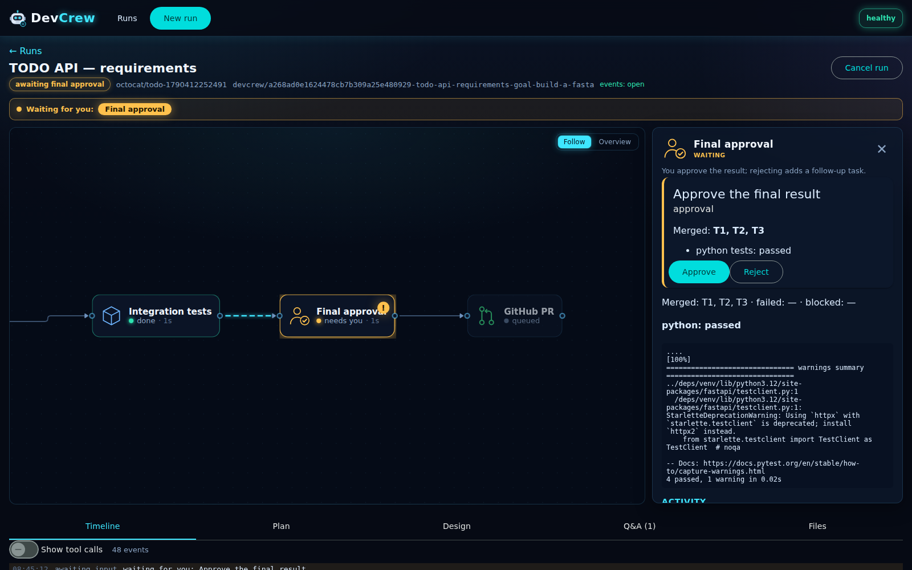
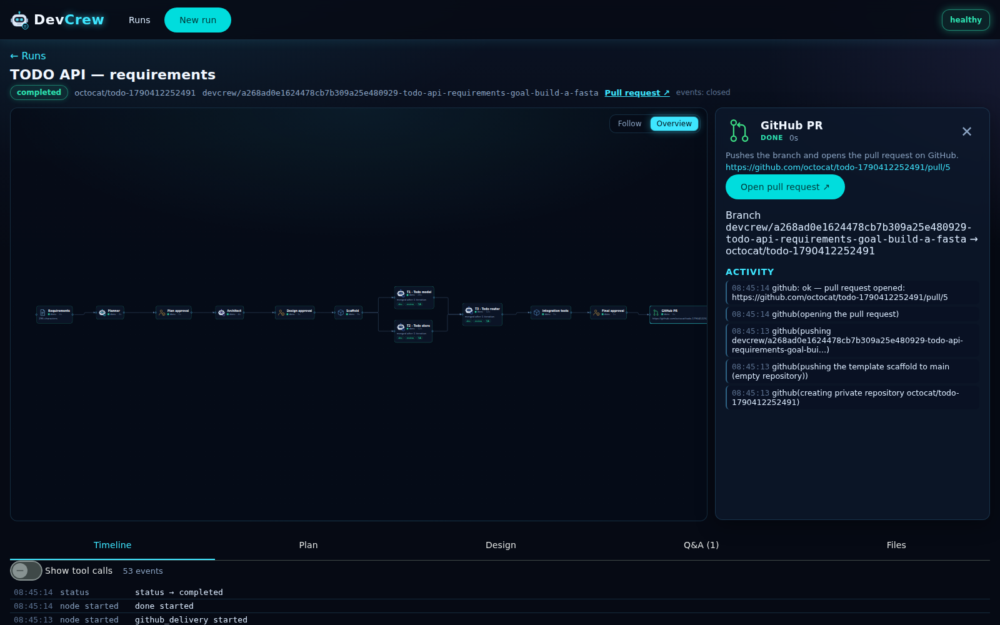

# 🧭 End-to-end example: from a requirements document to a pull request

This walk-through follows one DevCrew run, **a small TODO API**, from the requirements you
write to the pull request DevCrew opens on GitHub. It covers every step and what you see and do
at each one, including the approvals and a question from a developer.

> **About the material.** The screenshots come from a live walk-through of DevCrew with its
> scripted test model and a local GitHub stand-in. The artifacts shown (plan, design, review,
> test results, PR body) use DevCrew's real formats. With real Ollama models the content of
> each artifact differs from run to run, but the flow, the approvals and the formats are the
> same.



---

## ① Write the requirements

Save the requirements as `todo-requirements.md` (or type them straight into the form):

```markdown
# TODO API — requirements

## Goal
Build a FastAPI TODO API with CRUD and pytest tests.

## User stories
- As a user I can create, list, update and delete todos.
- As a user I get a 404 for unknown todo ids.

## Non-functional
- In-memory storage, no database.
- pytest tests for every endpoint.
```

Open **New run** (http://localhost:4200/runs/new):

1. Drop the file on the requirements box (or click **Upload .md / .txt**). The preview renders
   it, and the counter shows 295 / 20,000 characters.
2. Enter the repository, e.g. `octocat/todo-api`, and tick **Create the repository if it is
   missing (private)**.
3. Optionally set a **Budget** (tokens or working minutes).
4. Click **Start run**.


<details>
<summary>The same with the HTTP API</summary>

```bash
curl -s -X POST localhost:8080/runs -H 'content-type: application/json' -d @- <<'EOF'
{
  "request": "# TODO API — requirements\n\n## Goal\nBuild a FastAPI TODO API with CRUD and pytest tests.\n...",
  "repo_target": "octocat/todo-api",
  "create_repo": true
}
EOF
# → 201 {"id": "a268ad0e1624478cb7b309a25e480929", "status": "planning", ...}

curl -N localhost:8080/runs/<id>/events         # live progress (Server-Sent Events)
```
</details>

## ② The Planner breaks it down

The run page opens on the **workflow graph**. The Planner node glows while it works. It can ask
you a question if the requirements are ambiguous; here they are clear.



It produces a **plan**: user stories with acceptance criteria, and tasks with target files and
dependencies. DevCrew validates the plan: task ids are unique, dependencies exist and there are
no cycles.

```json
{
  "summary": "In-memory TODO API with CRUD endpoints and pytest tests",
  "user_stories": [
    {"id": "US1", "story": "As a user I want to create, list, update and delete todos",
     "acceptance_criteria": ["POST /todos returns 201 with the todo", "GET /todos lists all todos",
                             "PUT /todos/{id} updates, DELETE /todos/{id} returns 204"]},
    {"id": "US2", "story": "As a user I get a 404 for unknown todo ids",
     "acceptance_criteria": ["GET/PUT/DELETE of an unknown id return 404"]}
  ],
  "tasks": [
    {"id": "T1", "title": "Todo model", "description": "Pydantic schemas TodoCreate, TodoUpdate, Todo",
     "target_files": ["app/schemas/todo.py"], "depends_on": [], "stack": "python", "story_ids": ["US1"]},
    {"id": "T2", "title": "Todo store", "description": "In-memory store with create/list/get/update/delete",
     "target_files": ["app/services/store.py"], "depends_on": [], "stack": "python", "story_ids": ["US1", "US2"]},
    {"id": "T3", "title": "Todo router", "description": "CRUD endpoints on /todos using the store",
     "target_files": ["app/routers/todos.py"], "depends_on": ["T1", "T2"], "stack": "python", "story_ids": ["US1", "US2"]}
  ]
}
```

## ③ You approve the plan

The run waits: a **"Waiting for you: Plan approval"** banner appears and the side panel shows
the stories and the task table.



| Action | Effect |
|---|---|
| **Approve** | The Architect starts. |
| **Reject** + feedback | The Planner revises the plan with your feedback. The loop is shown on the graph ("rejected 1x"). |
| **Edit** | Change the plan's JSON yourself. It is validated before it is accepted. |

You can also send a **chat** message now ("use snake_case field names"); the Architect gets it
as a note. Here we click **Approve**.

## ④ The Architect designs it

The Architect picks the starter template from the catalog (`python-fastapi`), defines the
modules and their contracts, and **assesses the plan**:

```json
{
  "stack": "python",
  "template_id": "python-fastapi",
  "project_structure": ["app/main.py", "app/schemas/todo.py", "app/services/store.py", "app/routers/todos.py", "tests/"],
  "modules": [
    {"name": "schemas", "path": "app/schemas/todo.py", "responsibility": "Request/response models",
     "interface": "TodoCreate(title: str, done: bool=False), TodoUpdate, Todo(id: int, ...)"},
    {"name": "store", "path": "app/services/store.py", "responsibility": "In-memory CRUD",
     "interface": "create(TodoCreate) -> Todo; get(id) -> Todo | None; list(); update(id, TodoUpdate); delete(id) -> bool"},
    {"name": "todos", "path": "app/routers/todos.py", "responsibility": "CRUD endpoints",
     "interface": "GET/POST /todos, GET/PUT/DELETE /todos/{id}"}
  ],
  "key_decisions": ["in-memory dict store behind a service", "integer ids"],
  "plan_assessment": {
    "concerns": ["No task covers input validation errors (422 responses)"],
    "assumptions": ["Todos are kept in memory; no database"],
    "suggested_changes": ["Add acceptance criteria for 404 on unknown ids"]
  },
  "design_doc": "# Design\n..."
}
```

## ⑤ You approve the design

The panel shows the design and, highlighted, the **Architect's assessment of the plan**. The
assessment is advisory: to act on it, reject the design with feedback or go back to the plan.


We click **Approve**.

## ⑥ Scaffold

DevCrew prepares the workspace:

- It creates a git repository from the template and commits it to `main` ("Scaffold from
  template python-fastapi").
- It creates the **integration branch** `devcrew/a268ad0e…-todo-api-requirements-goal-build-a-fasta`.
- It installs the dependencies in the sandbox. This is the only step with network access, and
  it runs the template's fixed install command.
- It indexes the code for search (RAG).

## ⑦ Wave 1: T1 and T2 in parallel

T1 and T2 have no dependencies, so they start together (`MAX_PARALLEL_DEVS=2`). Each task gets:
- its own git worktree and branch (`devcrew/a268ad0e/task-T1`);
- its own sandbox container, with no network.


**A developer asks you a question.** While working on T1, the developer is unsure about ids and
calls `ask_human`. The node turns amber and the banner says **Waiting for you: T1 · Todo model**:



We answer *"Integers, auto-incrementing from 1."* The developer continues the same conversation
with the answer. T2 keeps working the whole time; only T1 waited. The question and answer are
kept in the **Q&A** tab and in the PR.

Every task then goes through the same loop:

| Step | What happens | Example output |
|---|---|---|
| 👩‍💻 **Developer** | Reads the contracts, retrieves related code, writes files, and can run commands in the sandbox. | commit `T1: Todo model (attempt 1)` |
| 🔍 **Reviewer** | Reviews the diff against the design and the rules in `rules/python.md`. | `{"decision": "approve", "summary": "Schemas match the contract", "issues": []}` |
| ✅ **QA** | Writes tests for the task and runs them with `pytest -q` in the sandbox. Pass/fail is the exit code. | `{"ran": true, "passed": true, "command": "pytest -q", "logs_excerpt": "6 passed in 0.21s"}` |
| 🔀 **Merge** | Squash-merges the task into the integration branch (one commit per task) and re-indexes the code. | `T1: Todo model` |

After the wave, DevCrew runs the project's tests on the integration branch, because T3 will
build on T1 and T2 together.

## ⑧ Wave 2: T3, the router

T3 starts once T1 and T2 are merged.



A typical review round-trip: the Reviewer asks for changes, citing a rule id from
`rules/python.md`:

```json
{
  "decision": "changes_requested",
  "summary": "POST must return 201 and unknown ids must return 404",
  "issues": [
    {"file": "app/routers/todos.py", "line": 18, "severity": "major",
     "message": "create_todo returns 200; it must return 201 with the created todo",
     "rule_ref": "PY-010"}
  ]
}
```

The feedback goes back to the developer (attempt 2 of `MAX_DEV_ITERATIONS=3`). The developer
fixes it, the Reviewer approves, QA's tests pass, and T3 is merged. If a task gets stuck (it hits
the attempt limit, a tool fails or a merge conflicts), the **Coordinator** steps in: it retries,
replans, splits the task or asks you.

## ⑨ Integration tests and quality gates

Once all tasks are merged, the whole test suite runs on the integration branch. Then the
quality gates run:

| Gate | Result |
|---|---|
| Secrets (gitleaks, changed files) | ✅ passed: no secrets in changed files |
| Dependencies (osv-scanner) | ✅ passed: no new vulnerabilities |
| Coverage (pytest-cov) | ✅ passed: 94% (minimum 70%) |

If a gate fails, DevCrew first adds an automatic fix task. Secrets can never be approved
through.

## ⑩ You approve the result

The final approval shows what was merged, the test results and the gates. Each task's diff is
one click away in its panel, and the **Files** tab browses the integration branch.



- **Approve** → the pull request is created.
- **Reject** + feedback → a follow-up task (`FIX1`) runs, then integration and gates run
  again. Chat messages you sent meanwhile are added to that feedback.

## ⑪ The pull request

After your approval, and only then, DevCrew pushes to GitHub:

1. It creates the private repository `octocat/todo-api` (we ticked "create if missing").
2. It pushes the template scaffold to `main` (the repository was empty).
3. It pushes the integration branch.
4. It opens the pull request against `main`.



Resulting history of the PR branch:

```text
* T3: Todo router
* T2: Todo store
* T1: Todo model
* Scaffold from template python-fastapi        (main)
```

The PR body is generated from the run:

```markdown
## Request
# TODO API — requirements
...

## Summary
In-memory TODO API with CRUD endpoints and pytest tests
### User stories
- **US1** As a user I want to create, list, update and delete todos
  - POST /todos returns 201 with the todo
  ...

## Design
Stack `python`, template `python-fastapi`.
<details><summary>Design document</summary> … </details>

## Tasks
| Task | Title       | Stack  | Status | Attempts | Tests  |
|------|-------------|--------|--------|----------|--------|
| T1   | Todo model  | python | merged | 1        | passed |
| T2   | Todo store  | python | merged | 1        | passed |
| T3   | Todo router | python | merged | 2        | passed |

## Quality gates
| Gate | Result | Summary |
...

## Test results (integration branch)
| Stack  | Result    | Command    |
|--------|-----------|------------|
| python | ✅ passed | `pytest -q` |

## Q&A log
- **developer → human** (T1): Should todo ids be integers or UUIDs?
  - Integers, auto-incrementing from 1.

---
_Generated by DevCrew (run `a268ad0e1624478cb7b309a25e480929`)._
```

The generated project:

```text
todo-api/
├── app/
│   ├── main.py              # FastAPI app, includes the todos router
│   ├── config.py
│   ├── schemas/todo.py      # T1
│   ├── services/store.py    # T2
│   └── routers/todos.py     # T3
├── tests/
│   ├── test_health.py       # from the template
│   └── test_*.py            # written by QA, one or more per task
└── pyproject.toml
```

## What happens next

- **The PR is followed up** (`WATCH_PRS=true`). Review comments from people with write access,
  failing CI checks and merge conflicts start **follow-up rounds** on the same branch. Small
  fixes are pushed automatically, bigger changes wait for your approval, and every thread gets
  a reply.
- **Usage**: the **Usage** tab shows the tokens per agent and per task, the model time, and
  the working time versus the time spent waiting for you.
- **Run again**: start a new run with the same (or an edited) request.

## Variations

| Scenario | What changes |
|---|---|
| **Existing repository** | Choose *Existing repository*. DevCrew first clones and detects the project (Python, Java/Maven, Angular), and the PR targets your default branch. |
| **Quick fix** | One change-plan approval; the Architect step is skipped. |
| **From a GitHub issue** | Label an issue `devcrew` (or `devcrew:quick`) in a watched repository, or import it on New run. DevCrew comments on the issue and the PR says `Fixes #N`. |
| **Steering** | Chat with the crew or a single task, pause and resume, set a budget. See the [technical guide](GUIDE.md#steering-running-work-phase-13). |
